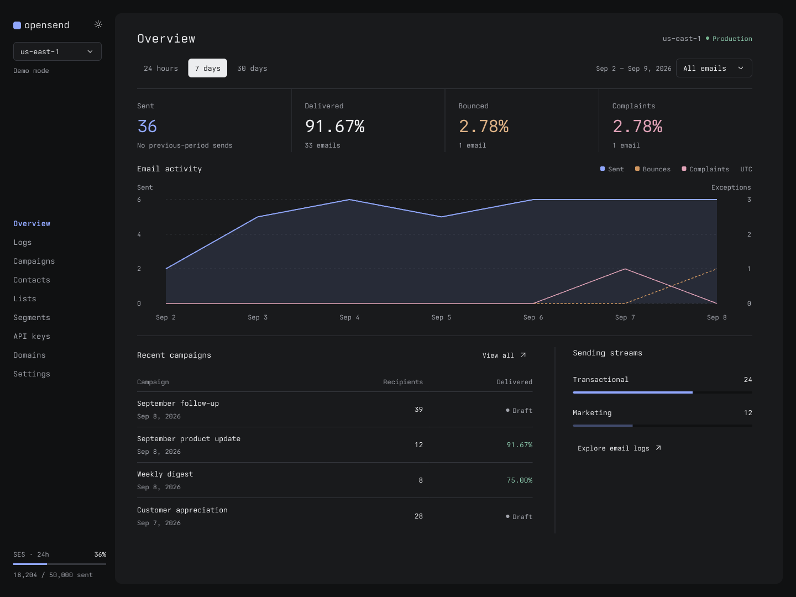
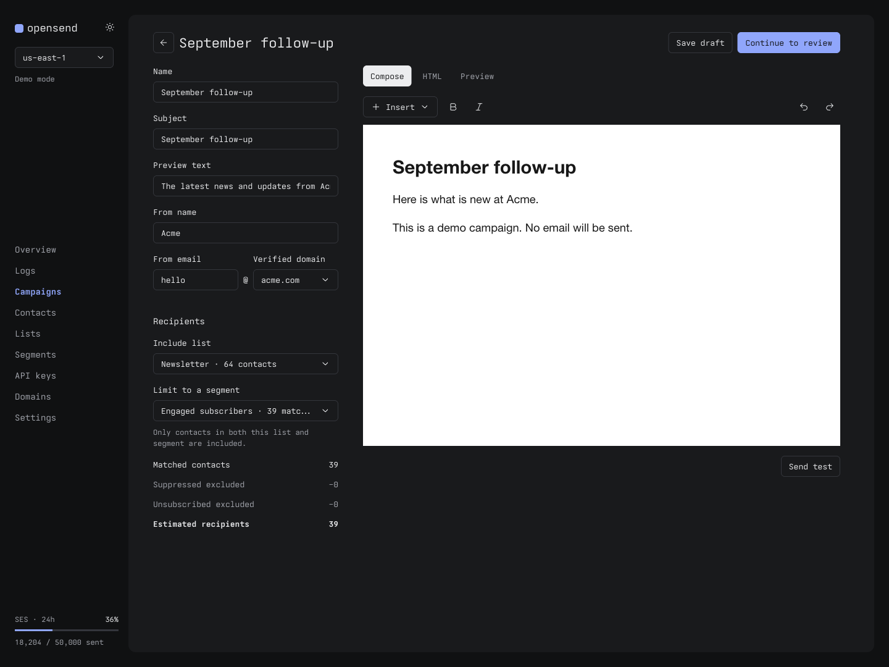
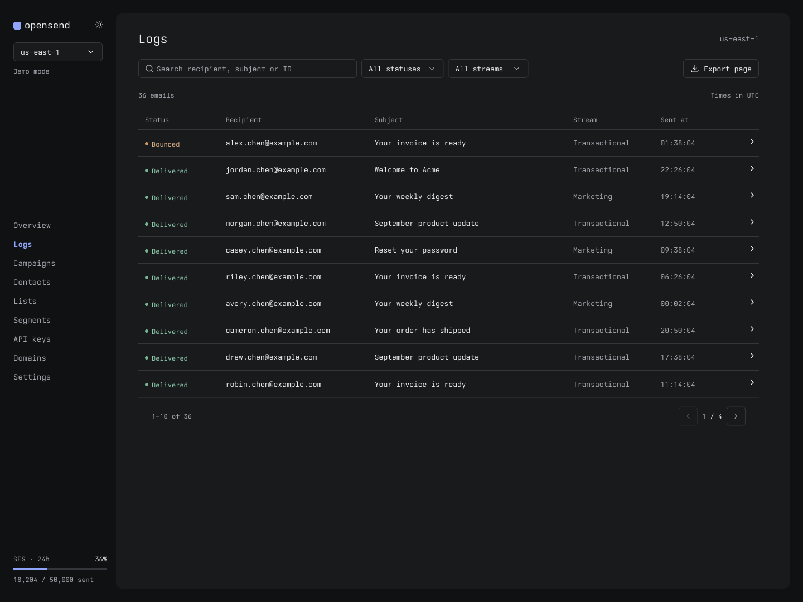

# opensend

Self-hosted transactional email, newsletters, and campaigns with Amazon SES. One installation, Google-only sign-in, and one public API shared by the dashboard, SDK, and MCP server. No passwords, teams, or browser-side API-secret setup.



<p>
  <a href="docs/images/campaign-composer.png"></a>
  <a href="docs/images/email-logs.png"></a>
</p>

## Start here

The screenshots above remain visual references. Start with simulated sending; `ENABLE_LIVE_SES=false` is the default.

1. **Install Node.js 24 and Docker Compose.** From this checkout, run `cd api`, `npm ci`, then `cp .env.example .env`. Keep `.env` private.
2. **Fill the local configuration.** Generate a random `BETTER_AUTH_SECRET` (at least 32 random bytes), Postgres password, and storage credentials. Match the Postgres password in `DATABASE_URL`. Leave `PUBLIC_URL=http://127.0.0.1:8793` for Docker. See [configuration](api/README.md#configuration).
3. **Create your own Google OAuth Web client.** Set its origin to `http://127.0.0.1:8793` and callback to `http://127.0.0.1:8793/api/auth/callback/google`. Put its client ID/secret in `.env` and your Google email in `AUTH_ALLOWED_EMAILS`. Complete the [Google consent and access setup](api/README.md#google-sign-in)—fake credentials cannot sign you in.
4. **Start storage, migrate, and run the app.** Follow the [Docker quickstart](api/README.md#docker-quickstart) to start Postgres/MinIO, create the private bucket once, build the image, migrate, and start both the API and job worker. Docker serves the dashboard and API together at `http://127.0.0.1:8793`.
5. **Sign in with your approved Google account.** Every approved user is an administrator. In **API keys**, create a **test** key (`os_test_…`) using the key-creation environment selector; key creation itself uses the live admin context. Use that key with the [SDK](sdk/README.md) or [read-only-by-default MCP server](mcp/README.md). Enable real sending only after [SES setup and release gates](api/README.md#ses-and-production-release-gates).

For editing the dashboard, use the [local development setup](api/README.md#local-development): Vite on **5173**, API on **8793**, and a Google callback through **5173**. Do not mix these URLs with the Docker setup.

## TypeScript SDK

Install [`opensend-js`](https://www.npmjs.com/package/opensend-js) from npm:

```sh
npm install opensend-js
```

Use ESM imports on your server. Set `OPENSEND_BASE_URL` to your installation's public URL and `OPENSEND_API_KEY` to an API key from its dashboard. Start with a test key to simulate sending without calling SES.

```ts
import { sendEmail } from 'opensend-js';
import { createClient } from 'opensend-js/client';

const client = createClient({
  baseUrl: process.env.OPENSEND_BASE_URL!,
  auth: scheme => scheme.scheme === 'bearer' ? process.env.OPENSEND_API_KEY : undefined,
});

const { data } = await sendEmail({
  client,
  headers: { 'Idempotency-Key': 'order-4821-receipt' },
  body: {
    from: 'receipts@example.com',
    to: ['recipient@example.com'],
    subject: 'Your receipt',
    text: 'Thank you for your order.',
  },
  throwOnError: true,
});

console.log(data.id);
```

The installation's default SES region is used unless you pass `region`. Keep API keys out of browser bundles. A queued response is not a delivery confirmation; use message status or webhooks to track the outcome. See the [SDK guide](sdk/README.md) for more operations, errors, and retry behavior.

## Deployment and verification

Use ordinary PostgreSQL and private S3-compatible storage, or provision [Cloudflare Workers, Hyperdrive, R2, and Queue resources](api/README.md#cloudflare). Remote PostgreSQL requires verified TLS. The Cloudflare configuration is a template, not a deployed service.

Local acceptance uses synthetic Google identities and mocked OAuth transport, **not real Google login**. Real Google consent/callback, live SES delivery, authentic SNS feedback, and public webhooks require separate verification with your own services. See [verification](api/README.md#verification) and [secret rotation / upgrades](api/README.md#secret-rotation-and-upgrades).
